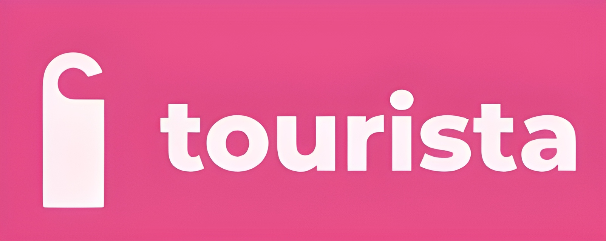

<h1 align="center">
    
</h1>

<h4 align="center">
    🚧 Construção 🚧
</h4>

 
 
 
 

# 💻 O Tourista no mundo

> Projeto educacional, proposto na disciplina Projetos I da CESAR School. Visa criar uma ferramenta interativa que explora os principais pontos turísticos e a cultura de uma determinada região.

### Principais pontos a serem percorridos durante a trilha de desenvolvimento:

<ul>
    <li>Fornecer Informações Turísticas Abrangentes: Criar uma plataforma online que ofereça informações detalhadas sobre pontos turísticos, atividades, acomodações e outras opções relevantes para viajantes.  
    </li>
    <li>Facilitar a Experiência do Viajante: Desenvolver uma interface intuitiva e amigável que permita aos usuários encontrar rapidamente as informações de que precisam para planejar suas viagens de forma eficiente.  
    </li>
    <li>Promover Destinos Turísticos: Destacar os destinos menos conhecidos e promover o turismo sustentável, incentivando os viajantes a explorar novas regiões e culturas.  
    </li>
    <li>Conectar Viajantes e Prestadores de Serviços: Estabelecer uma plataforma onde os viajantes possam interagir com prestadores de serviços locais, como hotéis, guias turísticos e empresas de transporte.
    </li>  
</ul>

O projeto foi desenvolvido a partir das seguintes tarefas:

- [x] Levantamento de requisitos;
- [x] Distribuição das funções dos membros da equipe;
- [x] Esboço do site Tourista;
- [x] Organização para a apresentação do Kickoff;
- [x] Projetar o fluxograma;
- [x] Escolher as tecnologias apropriadas;
- [x] Definir modelos de dados - por exemplo, pontos turísticos, avaliações, perfis de usuários;
- [x] Definir modelos de dados - por exemplo, pontos turísticos, avaliações, perfis de usuários;
- [x] Desenvolver o documento de requisitos;
- [] Desenvolver os componentes do sistema;
- [] Definir o time de arquitetura a ser implementada;
- [] Revisão do código e corrigir possíveis problemáticas;
- [] Apresentação do SR2.

## 💻 Requisitos

1. Fluxograma
2. Python
3. CRUD

